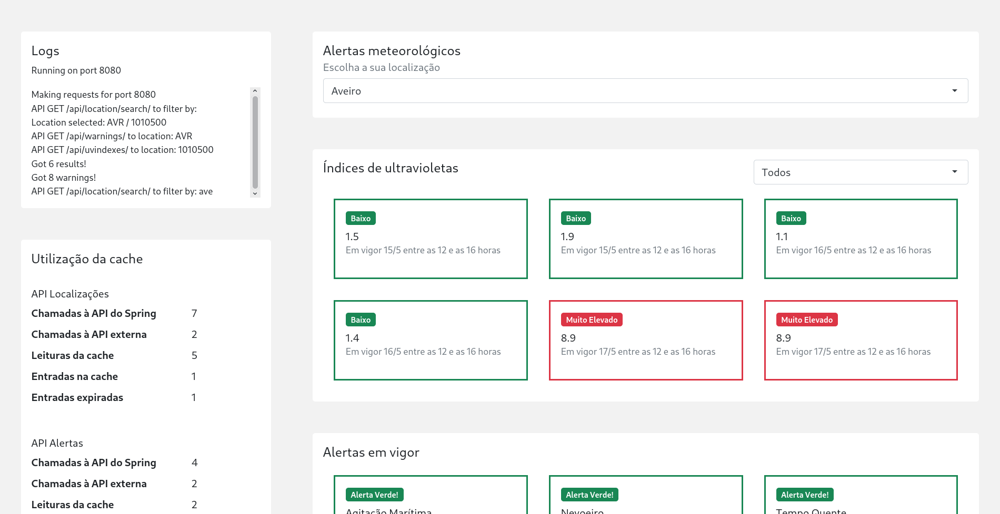

# Meteorology and UV index alerts

This project was developed in the context of [Software Quality And Tests](https://www.ua.pt/en/uc/8109) curricular unit, part of the Computer Science Bachelor at [Aveiro University](https://www.ua.pt/). It was lectured by [Ilídio Oliveira](https://www.ua.pt/pt/p/10318398) during the 2020/2021school year.

It was not graded yet.

> See a demo video by clicking on the image above.

## About the project

This project consists of a Spring Boot application for meteorology and UV index alerts dissemination gotten from Instituto Português do Mar e da Atmosfera public API. 

The main functional component of the app is the API, which mimics the external one, but it also provides a simple web page to test the previous and analyse its usage statistics. Despite that and because this work focus was to apply the expertise acquired on the curricular unit, <u>most of the effort was put in developing tests to cover all the levels in the right proportion</u>.

## Technology stack

The system was implemented in Java, using Spring Boot framework. For testing, I have integrated the following tools: Mockito, JUnit, AssertJ, Selenium, SonarQube, Jacoco, SonarLint inspection tool plugin for IntelliJ. I have also used Jenkins for Continuous Integration.

## Report

The report is available [here](doc/report.pdf).

## Author

[Gonçalo Matos](https://github.com/gmatosferreira)