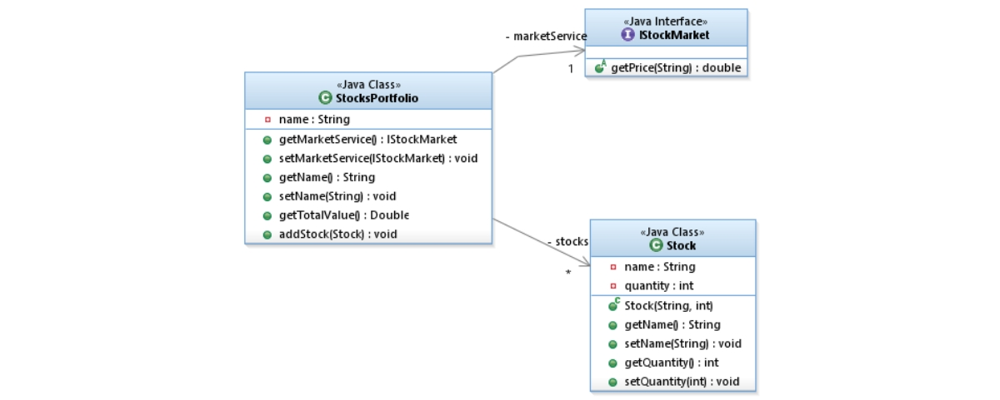

# Mockito

> [Documentação](https://javadoc.io/doc/org.mockito/mockito-core/latest/org/mockito/Mockito.html#1)

O [Mockito](https://site.mockito.org/) é uma framework de testes mock open-source para código Java, que permite <u>substituir dependências externas por **mocks**</u> no código de teste, verificando que o último se comporta como esperado durante a execução dos testes, sem necessidade de recorrer diretamente aos primeiros.


Os exemplos dados ao longo deste resumo têm por base o seguinte diagrama de classes.




## Stubbing

A substituição das dependências pelos mocks pode envolver, para além da criação dos **mocks**, a configuração do seu comportamento esperado em determinadas circunstâncias, processo designado por **stubbing**.

> O **stubbing** define o retorno de um determinado método para um determinado conjunto de argumentos. Não deve ser confundido com o conceito académico, que é dinstinto deste no contexto do Mockito.


Para tal recorre-se ao método `when(<methodWithParameters>).thenReturn(<returnValue>)`. 

Os parâmetros passados ao método podem ser específicos ou qualificativos, como por exemplo `anyString()`, que define o comportamento daquele método para todos os parâmetros que sejam uma String. 

> Podem ser encontrados mais matchers [aqui] (https://javadoc.io/doc/org.mockito/mockito-core/latest/org/mockito/ArgumentMatchers.html#any--).

Há ainda métodos alternativos ao `thenReturn`, como o `thenThrow` para gerar uma exceção.


```java
void getTotalValueWithMocks() {
    // Prepare mock
    IStockMarketService market = mock(IStockMarketService.class);
    
    // Create SUT and inject mock (IoC)
    StocksPortfolio portfolio = new StocksPortfolio(market);
    
    // Stubbing
    when(market.getPrice('EBAY')).thenReturn(4.0);
    
    // Run tests...
    portfolio.addStock(new Stock("EBAY", 2));
    assertEquals(4.0, portfolio.getTotalValue());    
}
```


Uma forma alternativa de escrever este teste é através da sintaxe `doReturn(<returnValue>).when(<object>).<methodCall>(<parameters>)`.

**É útil na definição do comportamento de métodos void!** 

```java
// Rewrite of stubbing above
doReturn(4.0)when(market).getPrice('EBAY');
```


## Verificação de comportamento

> [Documentação](https://javadoc.io/doc/org.mockito/mockito-core/latest/org/mockito/Mockito.html#verify-T-)

É também possível verificar o comportamento do **SUT** em cada **colaborator**, através do método `verify()`, que tem por base o histórico de uso do método.

Este aceita como argumento a instância a verificar e opcionalmente o número de chamadas que deve verificar que foram feitas. Não definir o número de chamadas verifica se foi feito pelo menos uma, pelo que é igual a definir `times(1)`.

```java
void getTotalValueWithMocks() {
    // ...
    
    // Verify behaviour
    // Metho .getPrice() should have been called only once
    verify(market, times(1)).getPrice( anyString() );
}
```


### Ordem das interações

```java
// Verifies that mocketObject has been used to call, in order, size(), add() and clear()
InOrder inOrder = Mockito.inOrder(mocketObject);
inOrder.verify(mocketObject).size();
inOrder.verify(mocketObject).add(anyString());
inOrder.verify(mocketObject).clear();
```


## Anotações

Em alternativa à sintaxe descrita nos exemplos anteriores podem ser utilizadas anotações, que facilitam a leligibilidade do código e simplificam a sua escrita.

Para tal, a classe de teste deve ser anotada com `@ExtendWith(MockitoExtension.class)`.

| Anotação       | Utilização                                             |
| -------------- | ------------------------------------------------------ |
| `@Mock`        | Instanciar o mock.                                     |
| `@InjectMocks` | Instancia SUT e injeta mock onde for necessário (IoC). |

```java
@ExtendWith(MockitoExtension.class)
public class StocksPortfolioTest {
    
    // Prepare mock
    @Mock
    IStockMarketService market;
    
    // Create SUT and inject mock (IoC)
    @InjectMocks
    StocksPortfolio portfolio;
    
    void getTotalValueWithMocks() {
        // ...
    }
    
}
```


### @Spy

> [Documentação](https://javadoc.io/doc/org.mockito/mockito-core/latest/org/mockito/Spy.html)

Esta é uma anotação que permite a criação de um **mock** especial, que <u>assume a implementação real</u> da classe do objeto instanciado.

No entanto, apesar de utilizar a lógica real, permite a utiliação das verificações do Mock para testar o número de chamadas aos métodos e ainda **stubbing** em cima disso, fazendo *override* à implementação real do objeto.

```java
@Spy
List<String> spiedList = new ArrayList<String>();

@Test
public void myTest() {
    spiedList.add("one");
    spiedList.add("two");
    
    Mockito.verify(spiedList).add("one");
    Mockito.verify(spiedList).add("two");
    
    assertEquals(2, spiedList.size());
    
    // Stubbing
    Mockito.doReturn(100).when(spiedList).size();
    assertEquals(100, spiedList.size());
}
```

> Sem o `@Spy`, o tamanho da lista não teria aumentado, uma vez que não havia funcionalidade no método `add()` e seria retornado o valor por defeito 0, ou outro definido através de stubbing.


### @Captor

> [Documentação](https://javadoc.io/doc/org.mockito/mockito-core/latest/org/mockito/Captor.html)

Esta anotação permite "perguntar" o argumento com o qual o método foi chamado, quando este depende de uma determinada situação imprevisível do teste.

```java
@Mock
List mockedList;

@Captor
ArgumentCaptor argCaptor;

@Test
public void myTest() {
    // In this case we know the argument is "one", but imagine we did not know it until running time
    mochedList.add("one");
    Mockito.verify(mockedList).add(argCaptor.capture());
    
    assertEquals("one", argCaptor.getValue());
}
```


## Boas práticas

O criador do Mockito criou um documento onde descreve um conjunto de boas práticas para a <u>escrita de bons testes</u>.

https://github.com/mockito/mockito/wiki/How-to-write-good-tests

> Este documento reflete o seu ponto de vista, pelo que pode ser subjetivo.


## Maven

Para utilizar o Mockito no Maven devem ser inseridas as seguintes dependências.

```xml
<properties>
    <mockito-core.version>3.3.3</mockito-core.version>
</properties>

<dependencies>
    <!-- Mockito-->
    <dependency>
        <groupId>org.mockito</groupId>
        <artifactId>mockito-core</artifactId>
        <version>${mockito-core.version}</version>
        <scope>test</scope>
    </dependency>
    <!-- Mockito/JUnit 5 integration (required for dependency injection) -->
    <dependency>
        <groupId>org.mockito</groupId>
        <artifactId>mockito-junit-jupiter</artifactId>
        <version>${mockito-core.version}</version>
        <scope>test</scope>
    </dependency>
</dependencies> 
```

