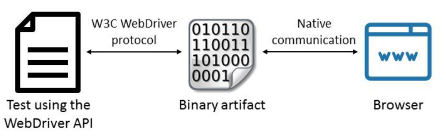
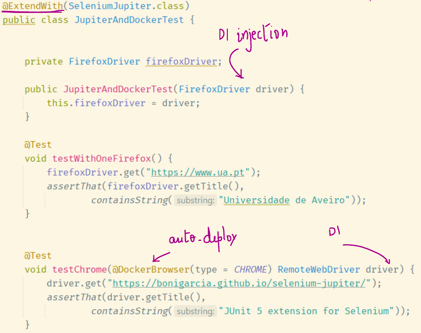

# Selenium

> [Tutoriais](https://www.softwaretestinghelp.com/selenium-tutorial-1/)

O **Selenium** é um ecossistema de automação de User Acceptance Tests open-source, desenvolvido pela organização sem fins lucrativos Software Freedom Conservancy.


## IDE

> Download para [Firefox](https://addons.mozilla.org/pt-PT/firefox/addon/selenium-ide/)
>
> Alternativa que permite gerar também testes em Selenium: [Katalon](https://www.katalon.com/katalon-recorder-ide/)

O IDE é uma extensão para o navegador que permite criar testes de forma interativa, "gravando" as interações do utilizador com a interface da aplicação web.

Permite a replicação dos testes gravados, exportação em código Java, ...


### Set up para Firefox

1. Fazer download do driver em https://github.com/mozilla/geckodriver/releases/;
2. Extrair driver e colocá-lo em `/opt/WebDriver/bin` (por exemplo);
3. Adicionar localização à variável `$PATH`;

```bash
export PATH=$PATH:/opt/WebDriver/bin >> ~/.profile
```

4. Testar que funciona;

```bash
chromedriver
```

> Output esperado:
>
> ```text
> Starting ChromeDriver 2.25.426935 (820a95b0b81d33e42712f9198c215f703412e1a1) on port 9515
> Only local connections are allowed.
> ```


### Comandos frequentes

> [Fonte](https://www.softwaretestinghelp.com/selenium-ide-script-selenium-tutorial-3/)

| Command                                                      | Description                                                  | #Argu  ments |
| ------------------------------------------------------------ | ------------------------------------------------------------ | ------------ |
| open                                                         | Opens a specified URL in the browser.                        | 1            |
| assertTitle, VerifyTitle                                     | Returns the current page title and compares it with the specified title | 1            |
| assertElementPresent, verifyElementPresent                   | Verify / Asserts the presence of an element on a web page.   | 1            |
| assertTextPresent, verifyTextPresent                         | Verify / Asserts the presence of a text within the web page. | 1            |
| type, typeKeys,   sendKeys                                   | Enters a value (String) in the specified web element.        | 2            |
| Click, clickAt,   clickAndWait                               | Clicks on a specified web element within a web page.         | 1            |
| waitForPageToLoad                                            | Sleeps the execution and waits until the page is loaded completely. | 1            |
| waitForElement  Present                                      | Sleeps the execution and waits until the specified element is present | 1            |
| chooseOkOnNext  Confirmation,   chooseCancelOn  NextConfirmation | Click on ”OK” or “Cancel” button when next confirmation box appears. | 0            |


## WebDriver

> [Documentação](https://www.selenium.dev/selenium/docs/api/java/org/openqa/selenium/WebDriver.html)

Como o nome indica, este projeto é um driver que permite a execução de testes escritos em diferentes linguagens em vários navegadores. 

> Algumas das linguagens suportadas são Python, Java, Ruby, C#, ...
>
> Cada navegador suportado tem um driver específico que implementa a mesma API (comum a todos).




Uma vez inicializado o driver, deve ser feito o acesso a uma página.

```java
Webdriver driver = new FirefoxDriver();
driver.get("https://sapo.pt");
// Do stuff
driver.quit();
```

Uma vez na página, são feitas ações sobre elementos.

```java
driver.findElement(By.id("formName")).sendKeys("Firsl Last" + Keys.Enter);
```

Para realizar estas ações, é necessário localizá-los. Para isto utiliza-se o método [`WebDriver.findBy(By b)`](https://www.selenium.dev/selenium/docs/api/java/org/openqa/selenium/WebDriver.html#findElement(org.openqa.selenium.By)) com recurso à classe [`By`](https://www.selenium.dev/selenium/docs/api/java/org/openqa/selenium/By.html), como no exemplo acima.

> Todos os métodos descritos abaixo retornam uma instância da classe `By`.

| Método                  | Descrição                                       |
| ----------------------- | ----------------------------------------------- |
| name(String n)          | Por atributo `name`                             |
| id(String id)           | Por atributo `id`                               |
| linkText(String text)   | Elemento `<a>` com texto exatamente igual.      |
| cssSelector(String css) | Pelo estilo.                                    |
| className(String class) | Pelo atributo `class`. Procurar por apenas uma! |

O `WebDriver.findBy(By b)` retorna uma instância da classe [`WebElement`](https://www.selenium.dev/selenium/docs/api/java/org/openqa/selenium/WebElement.html), sobre a qual podem ser realizadas ações.

| Método       | Descrição                                                    |
| ------------ | ------------------------------------------------------------ |
| click()      | Gera ação de clique sobre o elemento.                        |
| sendKeys()   | Escrever texto.<br />Para além disso podem ser passadas instâncias de certas teclas através da classe [`Keys`](https://www.selenium.dev/selenium/docs/api/java/org/openqa/selenium/Keys.html). |
| isSelected() | Permite validar se elemento (radio/checkbox) está selecionado. |


### Page object model

> [Discussion and example](https://www.toptal.com/selenium/test-automation-in-selenium-using-page-object-model-and-page-factory)

Este modelo foi criado para facilitar a legibilidade do código, potenciar a sua reutilização e evitar duplicação. Consiste em criar <u>uma classe para cada página analisada, encapsulando as interações de baixo nível na classe da página respetiva</u>.

> Isto permite à classe principal abstrair-se da implementação da interação. Assim, em caso de alteração dos elementos da página web (ID diferente, por exemplo), os testes apenas têm de ser mudados na classe que se refere a esta página, mantendo-se o código da principal intacto, uma vez que esta se abstrai da forma como este é implementado.

Esta classe recebe a instância do driver no seu construtor, de forma a poder realizar ações sobre este.


### Condições de corrida nos testes

Os elementos de uma página web não são todos renderizados de forma instantânea, havendo alguns que são renderizados por Javascript, por exemplo, e esperam pelo carregamento total da página. Neste caso, dada a natureza assíncrona dos pedidos ao navegador, os testes podem falhar, embora os elementos venham a ser renderizados.

Para este efeito podem ser declaradas através da classe [`WebDriverWait`](https://www.selenium.dev/selenium/docs/api/java/org/openqa/selenium/support/ui/WebDriverWait.html) esperas explícitas, que esperam que a condição pedida se verifique, ou expire (timeout, segundo argumento).

```java
driver.findElement(By.name("q")).sendKeys("cheese" + Keys.ENTER);
// Initialize and wait till element(link) became clickable - timeout in 10 seconds
WebElement firstResult = new WebDriverWait(driver, Duration.ofSeconds(10))
        .until(ExpectedConditions.elementToBeClickable(By.xpath("//a/h3")));
// Print the first result
System.out.println(firstResult.getText());
```


## Selenium Jupiter

> [Documentação](https://bonigarcia.github.io/selenium-jupiter/)

Esta é uma extensão ao JUnit5, que fornece uma integração do Selenium que permite a realização de UAT de forma mais simples. As suas principais características são:

- Injeção de dependências;
- Auto-deploy de containers Docker com drivers dos navegadores necessários.

