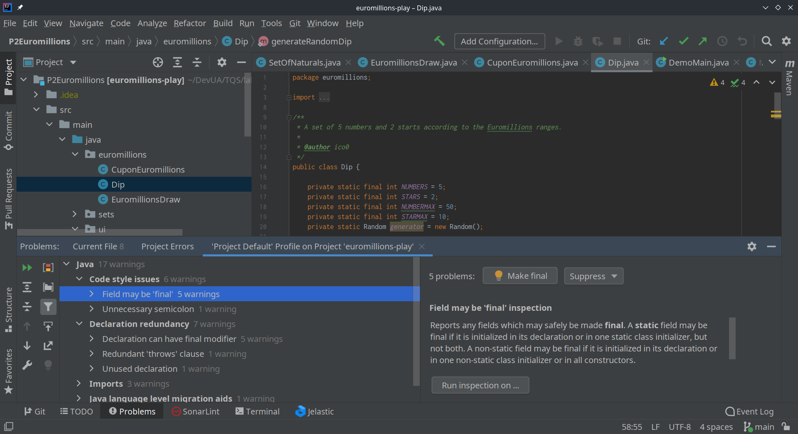
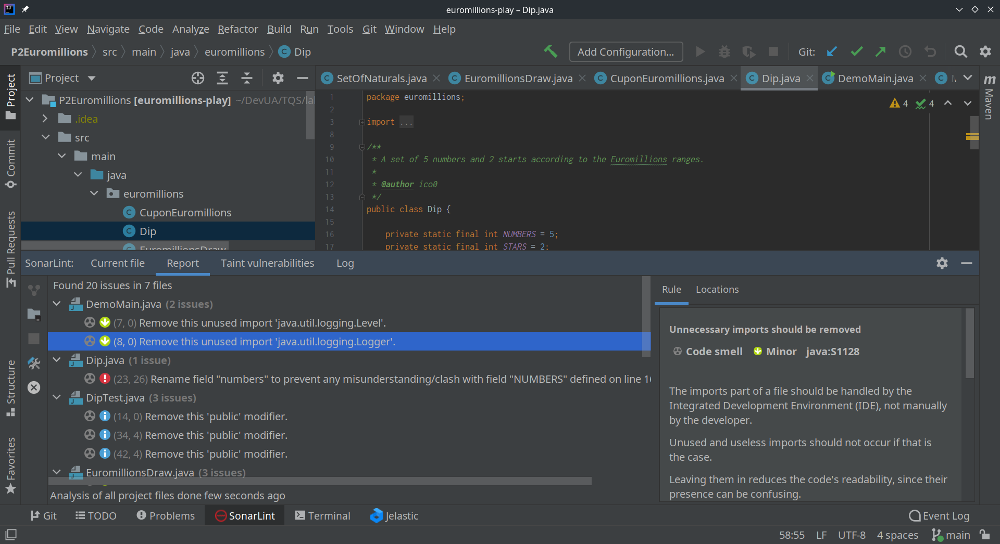

# Lab 6

1. e) The quality gate by default has a set of measure-based boolean conditions that should be met by <u>new code</u>. These are the following:

   - Coverage >= 80%
   - Duplicated lines (%) <= 3%
   - Maintainability Rating = A
   - Reliability Rating = A
   - Security Hotspots Reviewed = 100%
   - Security Rating = A

   However, as I am scanning a pre existent project (assumed as <u>overall code</u>) these conditions are not analysed for the project and the Sonar Cube assumes it meets the quality gate. Even though I have a coverage of 72.4% (<80%), a Reliability Rating of D (not A), between other "failures".

   These criteria will be applyed on the following scans, now assumed as for <u>new code</u> (since the last scan). However, as I have not changed the code, all the quality gate conditions will be met, as there is no code to review.

1. f) 

| Issue                | Problem description                                          | How to solve                                                 |
| -------------------- | ------------------------------------------------------------ | ------------------------------------------------------------ |
| Bug                  | <u>Save and re-use this `Random` on class `Dip`.</u> Creating a new `Random` object each time a random value is needed is inefficient and may produce numbers which are not random depending on the JDK. The `Random()` constructor tries to set the seed with a  distinct value every time. However there is no guarantee that the seed  will be random or even uniformly distributed. Some JDK will use the current time as seed, which makes the generated numbers not random at all. | For better efficiency and randomness, create a single `Random`, then store, and reuse it. |
| Code Smell (Blocker) | <u>Field `numbers` on on class `Dip` may be confused with `NUMBERS`.</u> Looking at the set of methods in a class, including superclass  methods, and finding two methods or fields that differ only by  capitalization is confusing to users of the class. It is similarly confusing to have a  method and a field which differ only in capitalization or a method and a field with exactly the same name and visibility. | Rename one of the fields.                                    |
| Code Smell (Major)   | <u>For loops, starting on lines 54 and 61 of class `Dip`.</u> A `for` loop stop condition should test the loop counter  against an invariant value (i.e. one that is true at both the beginning  and ending of every loop iteration). Ideally, this means that the stop  condition is set to a local variable just before the loop begins. | Refactor the code in order to not assign to this loop counter from within the loop body. |
| Code Smell (Major)   | <u>Using `System.out.println` at class `DemoMain`.</u> When logging a message there are several important requirements which must be fulfilled: The user must be able to easily retrieve the logs; The format of all logged message must be uniform to allow the user to easily read the log; Logged data must actually be recorded; Sensitive data must only be logged securely. | Replace `System.out.println` with a logger.                  |

2. a) The Technical Debt identifyed on the first scan (overall code) is of <u>2 hours and 17 minutes</u>. This concept in software engineering means the cost of implementing the easiest and most direct solutions (creating code smells) instead of the better aproach. The cost is represented in time that is necessary to correct the code smells created by following the easiest development aproach, maybe saving time then, but creating a debt for the future.

> Based on https://en.wikipedia.org/wiki/Technical_debt

2. d) There are 139 lines uncovered (70.3%) on the overall code and there are 56 conditions.

3. a) When analyzing the IES project (self service supermarket management system) results with the Sonar Qube, I've decided that most of the Sonar Qube default quality gate conditions are suitable for our project. I list them below:

   - Maintainability Rating = A
     - We have a maintainability rating of A and I think we should keep it that way. The technical debt should be reduced though (2 hours)...
   - Reliability Rating = A
     - We have 5 bugs, which gives a rating of D. We should improve this!
   - Security Hotspots Reviewed = 100%
     - As a semi autonomous system, it should be 100% secure. There is no room for security breaches!
   - Security Rating = A
     - As a semi autonomous system, it should be 100% secure. There is no room for security breaches!

   However, we have to change some because of our context.

   - Coverage (Remove from quality gate, as we have not developed unit testing for this)
   - Duplicated lines (%) <= 1%
     - We have 4.1%, but mostly because of similar endpoints. This can be easily corrected with some refactoring and I think that 1% is feasible. 

4. a) Evidence of running IntelliJ code inspection tool.

4. b) Evidence of running Sonar Qube in IntelliJ with plugin.

